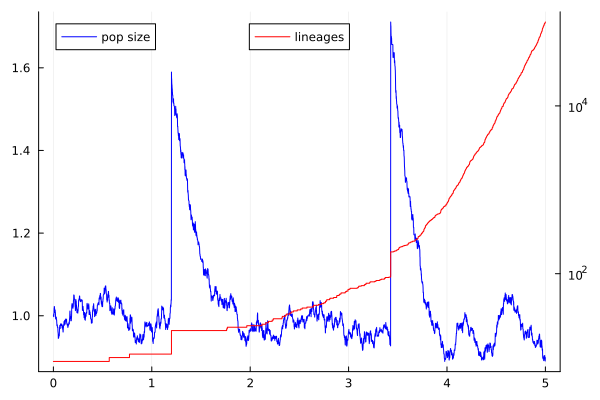
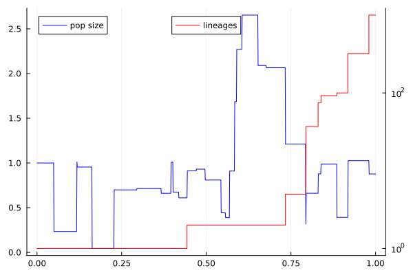
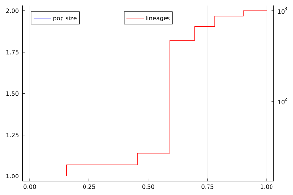
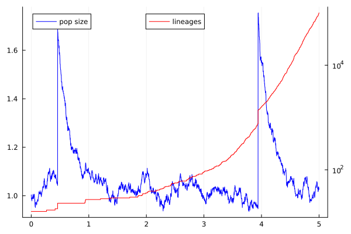

# Simulations for the $(\gamma, \Pi)$-Fleming-Viot model
> This repository contains the code used to generate simulations of the model presented in our preprint **A $\Lambda$-Fleming-Viot type model with intrinsically varying population size** (available [here](INSERT_URL_HERE)).

We present here the code for simulating the evolution of both the population size process forwards-in-time as well as the lineage counting process backwards-in-time, following the dynamics of the $(\gamma, \Pi)$-Fleming-Viot model. It is out hope that it might be of use to other who a) want to investigate the behaviour of the model or b) are interested in studying its statistics.



## The Model
In Section 2 of the paper, we introduce a new model for the evolution of the gene distribution in a population. In Section 6, we derive a representation of the model as a $\Lambda$-Fleming-Viot in a random environment. As such, it is mostly of interest to simulate the population size process $(N_t)_{t\in [0,T]}$ and the lineage counting process $(n_t)_{t\in [0,T]}$ (backwards in time).

Fix a characteristic $(\gamma, \Pi)\in\mathfrak{C}$, i.e.
1. $\gamma = (\gamma_d, \gamma_b)\in \mathbb R^2$,
2. $\Pi$ a $\sigma$-finite measure on $\mathcal Z := \big( [0,1]\times [0,+\infty) \big)\setminus \{(0,0), (1,0)\}$
3. and verifying both $\gamma \geq 0$ and $\gamma_d + \int_{\mathcal Z} z_d d\Pi(z) = \gamma_b + \int_{\mathcal Z} z_b d\Pi(z)$, including the fact that both integrals are finite.

For the purpose here, we will always assume $\Pi$ to be a finite measure. Others may be approximated by cutting off the singularity in $(0,0)$.

### Population size process

The dynamics of the population size process are given by the SDE
$$N_t = N_0 + \int_0^t \Big(\gamma_b - \gamma_d N_s\Big) ds + \int_{[0,t]\times \mathcal Z} \Big( z_b - z_d N_{s-} \Big) \xi(ds, dz),$$
where $\xi$ is a Poisson point process on $[0,T]\times \mathcal Z$ with mean intensity $ds\otimes \Pi(dz)$.

### Lineage Counting Process

Fix $n_0\in\mathbb N$ as initial value. Conditionally on the noise $\xi$, the lineage counting process can be constructed as follows: in between points in $\xi$, the process does not involve. Starting from the final time $T$, enumerate the points $(t^i, z^i)\in \xi$. Iteratively, set $$n_{T-t^i} := \min(n_{(T-t^i)-}, n_{(T-t^i) - } + 1 - k),$$
where $k\sim \mathrm{Bin}(n_{(T-t^i)-}, \frac{z_b^i}{N_{t^i} + z_b^i})$ independently of the past.

## Usage Examples

Here, we present some examples to illustrate the basic use of the code.

```julia
using GammaPiModel
using Distributions

# define $\Pi$ as the distribution of two independent uniform distributions
distr = Uniform(0.0, 1.0)
Pi = product_distribution( distr, distr )
# consider 0 drift as births and deaths already balanced (in mean)
gamma = [0, 0]

# simulate and plot both the population size process and the lineage counting process
simulate_fleming_viot(drift=gamma, intensity=30.0, distribution=Pi)
```


The next example shows how to implement a model with _constant_ population size. This is a subclass and may be of interest to compare to the classical $\Lambda$-Fleming-Viot framework.

```julia
using GammaPiModel
using Distributions

# define $\Pi$ as the distribution $[U,U]$ for a uniform rv $U$.
distr = Uniform(0.0, 1.0)
Pi = Doubling(distr)
# drift as before
gamma = [0, 0]

# simulate and plot both the population size process and the lineage counting process
simulate_fleming_viot(drift=gamma, intensity=10., distribution=Pi)
```

The next example simulates a more interesting situation in which most of the jumps are very small and only a few a large. For simplicity, we choose again a product distribution. However, to illustrate the drift, we will choose two different distribution governing the deaths and the births.

```julia
using GammaPiModel
using Distributions

# Define the marginals as mixtures of small jumps and large jumps
distr_d = MixtureModel( [ Uniform(0., 0.01), Uniform(0.01, 0.02)], [0.99, 0.01] )
distr_b = MixtureModel( [Uniform(0., 0.01), Uniform(0.51, 0.82)], [0.9998, 0.0002] )

distribution = product_distribution( distr_d, distr_b )

# if not specified, the drift is adjusted automatically to balance births and deaths
# `n0`specifies the number of initial lineages; `T`denotes the time horizon
simulate_fleming_viot(intensity=1000., distribution=Pi, T=5., n0=100000)
```


## Authors
- Julian Kern ([Contact](mailto:kern-Please_Remove_This_Text-@wias-berlin.de))
- Bastian Wiederhold ([Contact](mailtobastian.wiederhold-Please_Remove_This_Text-@wadham.ox.ac.uk))
## License
This project is licensed under the GNU Affero General Public License v3.0.
